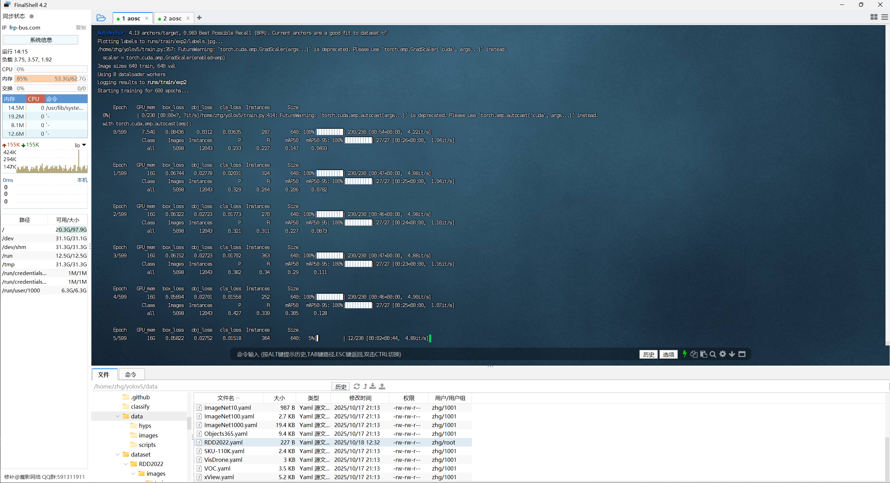

# 方案
这里使用yolov5s作为预训练模型，老演员没啥说的

数据集采用[RDD2022](https://datasetninja.com/road-damage-detector)

部署在Sipeed的Maixcam上，Maixcam搭载的NPU拥有1TOPS@INT8算力，在这里足够用了，后面有需要可以换更强劲的硬件，具体参数可以看[这里](https://wiki.sipeed.com/hardware/zh/maixcam/maixcam.html#MaixCAM-%E7%A1%AC%E4%BB%B6%E7%AE%80%E4%BB%8B)

由于需要调用板载的NPU进行推理，这里需要进行模型转换，这里使用Sipeed官方提供的[平台](https://maixhub.com/toolbox/convert/v831)


# 模型训练
这里训练使用的配置如下
| 配置项       | 参数                |
|------------|---------------------|
| CPU        | Intel Xeon Platinum 8378A |
| 内存        | 64GB DDR4           |
| GPU        | NVIDIA RTX 3090 24GB x3|
| 操作系统     | AOSC OS 12.2.2   |
| CUDA版本    | 13.0                |
| Python版本  | 3.11                 |
| PyTorch版本 | 2.9.0               |

相当奢侈，但是因为是临时借来玩的，所以不存在浪费（

虽然这个服务器上插了三张3090，但是由于桥接器拆下来了，没有nvlink，本次只用到一张

## 下载数据集并进行清洗
从Dataset Ninja下载的数据集不能直接用于yolo模型训练，我们首先需要编写脚本进行格式转换
```python
import os
import json
import random
import shutil
from tqdm import tqdm
import yaml

# --- 1. 配置参数  ---

# 原始 RDD2022 数据集的根目录
RDD2022_ROOT = './RDD2022'

# 清洗后用于 YOLO 训练的数据集输出目录
YOLO_DATASET_ROOT = './RDD2022_YOLO'

# 验证集划分比例 (例如: 0.2 表示将原始训练数据中的 20% 作为验证集)
VAL_SPLIT_RATIO = 0.2

# RDD2022 数据集的类别
# 请确保这里的顺序与你训练时使用的顺序一致
CLASSES = [
    'longitudinal crack', 'transverse crack', 'alligator crack', 'pothole', 'ther corruption', 'other corruption',
]

# --- 2. 核心转换函数 ---

def convert_supervisely_to_yolo(img_size, points):
    """
    将 Supervisely 的矩形框坐标转换为 YOLO 格式
    参数:
        img_size: 图片尺寸 [width, height]
        points: Supervisely 的坐标点 [[xmin, ymin], [xmax, ymax]]
    返回:
        归一化后的 YOLO 格式坐标 [x_center, y_center, width, height]
    """
    img_width, img_height = img_size
    
    xmin = min(points[0][0], points[1][0])
    ymin = min(points[0][1], points[1][1])
    xmax = max(points[0][0], points[1][0])
    ymax = max(points[0][1], points[1][1])

    dw = 1. / img_width
    dh = 1. / img_height
    
    x_center = (xmin + xmax) / 2.0 * dw
    y_center = (ymin + ymax) / 2.0 * dh
    width = (xmax - xmin) * dw
    height = (ymax - ymin) * dh
    
    return (x_center, y_center, width, height)

def process_json_file(json_path, class_map):
    """
    解析单个 Supervisely JSON 文件，并返回 YOLO 格式的标注内容
    """
    yolo_labels = []
    with open(json_path, 'r') as f:
        data = json.load(f)
    
    img_height = data['size']['height']
    img_width = data['size']['width']
    
    for obj in data['objects']:
        # 确保是矩形标注
        if obj['geometryType'] != 'rectangle':
            continue
            
        cls_name = obj['classTitle']
        if cls_name not in class_map:
            print(f"警告: 在 {os.path.basename(json_path)} 中发现未知类别 '{cls_name}'，已跳过。")
            continue
            
        cls_id = class_map[cls_name]
        
        # Supervisely 的坐标点
        points = obj['points']['exterior']
        
        yolo_box = convert_supervisely_to_yolo((img_width, img_height), points)
        
        yolo_labels.append(f"{cls_id} {' '.join([f'{coord:.6f}' for coord in yolo_box])}")
        
    return yolo_labels

# --- 3. 主执行逻辑 ---

def main():
    print("--- 开始清洗和转换 RDD2022 (Supervisely JSON 格式) 数据集 ---")

    # 创建类别到ID的映射
    class_to_id = {cls: i for i, cls in enumerate(CLASSES)}
    
    # 路径定义
    ann_dir = os.path.join(RDD2022_ROOT, 'train', 'ann')
    img_dir = os.path.join(RDD2022_ROOT, 'train', 'img')

    # 1. 查找所有的 JSON 标注文件
    print("步骤 1/5: 正在扫描所有 JSON 标注文件...")
    if not os.path.isdir(ann_dir):
        print(f"错误: 标注目录 '{ann_dir}' 不存在。请检查 RDD2022_ROOT 路径是否正确。")
        return
        
    all_json_files = [f for f in os.listdir(ann_dir) if f.endswith('.json')]
    
    if not all_json_files:
        print(f"错误: 在 '{ann_dir}' 目录下没有找到任何 JSON 文件。")
        return
        
    print(f"完成。共找到 {len(all_json_files)} 个标注文件。")

    # 2. 随机打乱并划分数据集
    print("步骤 2/5: 正在随机划分训练集和验证集...")
    random.shuffle(all_json_files)
    
    split_index = int(len(all_json_files) * (1 - VAL_SPLIT_RATIO))
    train_files = all_json_files[:split_index]
    val_files = all_json_files[split_index:]
    
    datasets = {
        'train': train_files,
        'val': val_files
    }
    
    print(f"划分完成: {len(train_files)} (训练), {len(val_files)} (验证)")

    # 3. 创建 YOLO 格式的目录结构
    print("步骤 3/5: 正在创建 YOLO 目录结构...")
    for split in ['train', 'val']:
        os.makedirs(os.path.join(YOLO_DATASET_ROOT, 'images', split), exist_ok=True)
        os.makedirs(os.path.join(YOLO_DATASET_ROOT, 'labels', split), exist_ok=True)
    print("目录创建完成。")

    # 4. 处理文件并复制
    print("步骤 4/5: 正在转换标注并复制文件...")
    for split, files in datasets.items():
        print(f"\n处理 {split} 集...")
        for json_filename in tqdm(files, desc=f"Processing {split} files"):
            try:
                # 构建源文件路径
                json_path = os.path.join(ann_dir, json_filename)
                
                # Supervisely 的 json 文件名通常是 '图片名.json'
                # 我们需要从中提取出原始图片名
                base_img_filename = os.path.splitext(json_filename)[0] # 移除 .json
                src_image_path = os.path.join(img_dir, base_img_filename)

                if not os.path.exists(src_image_path):
                    print(f"警告: 找不到对应的图片 {src_image_path}，跳过 {json_filename}")
                    continue

                # 转换 JSON 标注
                yolo_content = process_json_file(json_path, class_to_id)
                
                # 如果图片中没有我们定义的任何类别，可以跳过
                if not yolo_content:
                    continue

                # 定义目标路径
                dest_image_path = os.path.join(YOLO_DATASET_ROOT, 'images', split, base_img_filename)
                
                # label文件名应与图片名一致，只是扩展名不同
                label_filename = f"{os.path.splitext(base_img_filename)[0]}.txt"
                dest_label_path = os.path.join(YOLO_DATASET_ROOT, 'labels', split, label_filename)

                # 复制图片
                shutil.copy(src_image_path, dest_image_path)
                
                # 写入 YOLO 标签文件
                with open(dest_label_path, 'w') as f:
                    f.write('\n'.join(yolo_content))
            except Exception as e:
                print(f"处理文件 {json_filename} 时发生错误: {e}")

    # 5. 创建 dataset.yaml 文件
    print("\n步骤 5/5: 正在创建 dataset.yaml 文件...")
    yaml_data = {
        'path': os.path.abspath(YOLO_DATASET_ROOT), # 数据集根目录的绝对路径
        'train': 'images/train',
      'val': 'images/val',
        # 如果你也有测试集，可以取消下面一行的注释
        # 'test': 'images/test', 
        'nc': len(CLASSES),
        'names': CLASSES
    }

    yaml_path = os.path.join(YOLO_DATASET_ROOT, 'dataset.yaml')
    with open(yaml_path, 'w') as f:
        yaml.dump(yaml_data, f, sort_keys=False, allow_unicode=True)
        
    print(f"dataset.yaml 文件已创建于: {yaml_path}")
    print("\n--- 所有任务完成！数据集已准备好用于 YOLO 训练。 ---")


if __name__ == '__main__':
    # 确保安装了必要的库
    try:
        import yaml
        from tqdm import tqdm
    except ImportError:
        print("错误: 缺少必要的库。请运行 'pip install pyyaml tqdm'")
    else:
        main()
```

~~AI真是太好用了你们知道吗~~
## 训练
(此处略过下载yolo，配置环境的部分，我是用的是yolov5 7.0,环境管理使用uv)

我们在yolo目录下创建dataset文件夹，把我们清洗好的RDD2022数据集挪到这里
此时我的文件结构如下
```bash
/datasets/
├── RDD2022
│   ├── images
│   │   ├── train
│   │   └── val
│   └── labels
│       ├── train
│       └── val
└── dataset.yaml
```
回到终端，激活环境

```python
python train.py --data RDD2022.yaml --epochs 600 --weights yolov5s.pt --batch-size 128 --imgsz 640 --workers 16 --patience 50 --cos-lr --save-period 25
```
愉快的开始训练

## 可视化
安装Tensorboard
```python
uv pip install tensorboard
```
在yolo文件夹下输入
```python
tensorboard --logdir=./runs
```
访问http://localhost:6006/即可查看

# 模型转换
## 导出ONNX模型
这里我们使用yolo官方提供的脚本进行转换
```python
python export.py --weights runs/train/exp3/weights/best.pt --include onnx
```
 导出的时候应该有很多参数可选，但这里我比较懒，选择略过

 ## 模型转换
 打开Sipeed提供的[转换工具](https://maixhub.com/toolbox/convert/v831)
 
 根据文档要求，我们需要将ONNX文件和训练用到的图片打成一个zip压缩包
 ```bash
 /RDD2022
  ├── images
  │   ├── xxx.jpg
  │   └── xxx.jpg
  └── xxx.onnx
```
这里的图片是用于将模型量化为int8模型，图片分辨率需要和模型输入保持一致

# 踩坑记录
假如你跟我的环境一样，按照上面的步骤操作，那么你最后的模型转换是绝对会失败的
## 原因分析
### 环境配置
- maixhub提供的转换工具要求低版本的 ir_version，也就是需要安装旧版本的onnx库
- YOLOv5 V7.0 要求不低于 onnx==1.13.0(因为它需要 onnx.reference 模块)
- torch >= 2.x 与旧的 onnx==1.13.1 不兼容
- onnx-simplifier 依赖 NumPy 2.x，而旧的 torchvision 依赖 NumPy 1.x(不过最后也没用上simplifier)

最后采用
- `torch==1.13.1`
- `torchvision==0.14.1`
- `onnx==1.13.1`
- `numpy==1.26.4`
- 导出onnx模型的时候加上`--opset=12`避免算子不兼容
### 不支持的 `SiLU` 激活函数
AWNN Tools v0.9.6 不认识 SiLU (也叫 Swish) 激活函数，导致转换 ncnn 到 awnn 时崩溃 (layer Swish not exists or registered)

但是由于我训练模型的是没有考虑这个问题，因此需要单独使用一个脚本将SiLU替换为ReLU，保存为一个新的文件

替换脚本如下
```python
import torch
import torch.nn as nn
import sys
import logging
from models.common import Conv
from models.yolo import Model

# --- 关键：确保所有 YOLOv5 类都已导入 ---
# (我们导入 Conv 和 Model 就足够让 torch.load 工作了)

# 设置日志
logging.basicConfig(level=logging.INFO)
logger = logging.getLogger(__name__)

def replace_activations(module):
    """
    递归地查找所有 Conv 模块, 并将其 .act 属性从 SiLU 替换为 ReLU
    """
    count = 0
    for name, child in module.named_children():
        # 检查子模块是否为 Conv 块
        if isinstance(child, Conv):
            if isinstance(child.act, nn.SiLU):
                child.act = nn.ReLU()
                count += 1
                logger.info(f"Patched activation in module: {name}")
        
        # 递归进入子模块
        count += replace_activations(child)
    return count

if __name__ == "__main__":
    if len(sys.argv) != 3:
        print("\n[用法错误]")
        print("请提供 输入模型 和 输出模型 路径")
        print("例如: python patch_model.py runs/train/exp3/weights/best.pt best_relu.pt\n")
        sys.exit(1)

    input_path = sys.argv[1]
    output_path = sys.argv[2]

    logger.info(f"正在加载 checkpoint: {input_path}")
    
    try:
        device = torch.device('cpu')
        # 加载 checkpoint。
        # 此时 models/common.py 必须是原始版本 (使用 SiLU)，否则加载会失败
        ckpt = torch.load(input_path, map_location=device)
    except Exception as e:
        logger.error(f"加载 checkpoint 失败。请确保你已将 models/common.py 还原回原始的 SiLU 版本。")
        logger.error(f"错误详情: {e}")
        sys.exit(1)

    # 模型通常存储在 'model' 键中
    if 'model' in ckpt:
        model = ckpt['model'].float()  # 加载模型并确保为全精度
    else:
        logger.error("在 .pt 文件中未找到 'model' 键。")
        sys.exit(1)
        
    logger.info("开始替换激活函数 SiLU -> ReLU ...")
    
    total_replaced = replace_activations(model)
    
    if total_replaced > 0:
        logger.info(f"成功替换了 {total_replaced} 个 SiLU 激活函数。")
        
        # 将修补后的模型放回 checkpoint 字典
        ckpt['model'] = model
        
        # (可选) 清理 checkpoint，减小文件大小
        if 'optimizer' in ckpt:
            del ckpt['optimizer']
        if 'ema' in ckpt:
            del ckpt['ema']
            
        logger.info(f"正在保存已修补的模型到: {output_path}")
        torch.save(ckpt, output_path)
        logger.info("完成。")
    else:
        logger.warning("没有找到任何 SiLU 激活函数。模型可能已经是 ReLU？")
```

### 无法解析的 `Detect` 检测头
解决完激活函数后重新上传训练，仍然报错

检查日志后发现，AWNN Tools v0.9.6 还是太旧了，它无法理解 YOLOv5 检测头的结构

最后仍然是写一个脚本，来进行“断头”操作，移除最后的 `Detect` 层

脚本如下：
```python
import torch
import sys
import logging

# --- 导入 YOLOv5 模块，以便 torch.load 可以工作 ---
from models.common import Conv
from models.yolo import Model, Detect, Segment, ClassificationModel, DetectionModel, SegmentationModel

# 设置日志
logging.basicConfig(level=logging.INFO)
logger = logging.getLogger(__name__)

if __name__ == "__main__":
    if len(sys.argv) != 3:
        print("\n[用法错误]")
        print("请提供 输入模型 和 输出模型 路径")
        print("例如: python patch_no_head.py best_relu.pt best_relu_no_head.pt\n")
        sys.exit(1)

    input_path = sys.argv[1]
    output_path = sys.argv[2]

    logger.info(f"正在加载 checkpoint: {input_path}")
    
    try:
        device = torch.device('cpu')
        # 加载我们之前修补过的 best_relu.pt
        ckpt = torch.load(input_path, map_location=device)
    except Exception as e:
        logger.error(f"加载 checkpoint 失败。错误: {e}")
        sys.exit(1)

    if 'model' not in ckpt:
        logger.error("在 .pt 文件中未找到 'model' 键。")
        sys.exit(1)

    model = ckpt['model']
    
    # --- 关键步骤：移除检测头 ---
    try:
        # model.model 是一个 nn.ModuleList
        # 最后一层 (model.model[-1]) 就是 Detect 层 (model.24)
        logger.info(f"正在移除检测头 (模型最后一层): {type(model.model[-1])}")
        
        # 移除列表中的最后一项
        model.model.pop(-1)
        
        logger.info("检测头移除成功。")
        
        # 将修补后的模型放回 checkpoint 字典
        ckpt['model'] = model
        
        # (可选) 清理 checkpoint，减小文件大小
        if 'optimizer' in ckpt:
            del ckpt['optimizer']
        if 'ema' in ckpt:
            del ckpt['ema']
            
        logger.info(f"正在保存已“断头”的模型到: {output_path}")
        torch.save(ckpt, output_path)
        logger.info("完成。")

    except Exception as e:
        logger.error(f"移除检测头失败。错误: {e}")
        sys.exit(1)
```

# 总结
这是我第一次训练yolo模型并量化部署在嵌入式平台

中间坑还是不少，记录一下也方便后面查阅

如果能帮到别人那再好不过了

# 效果展示
(待续)